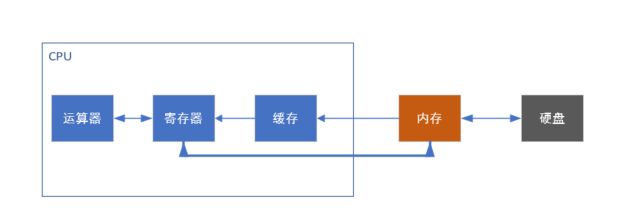
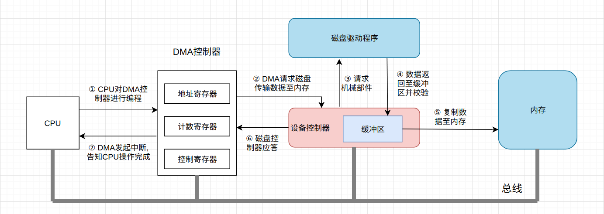

# 异步的演变


## 计算机的编译和执行

#### 1. 编译

c源程序 ----> 汇编.s -----> 二进制文件.o -----> 链接器(静态/动态) ----> 可执行文件

可执行文件包括了这些数据段

- ELF头文件段
通常会存放一些基本信息，通常比较关心的就是ELF的类型，32位还是64位，使用`readelf -h 文件`来查看即可,查看段的具体信息可以使用`objdump -h 文件`来看每个段的大小,也可以通过`objdump -D 文件`来反汇编文件，查看到的就是文件的汇编(所有的段汇编源码)

- 程序的指令.text代码段

代码段可以通过`objdump -s 文件`查看源码

- 数据.data数据段 (初始化的全局变量和静态变量)

代码段可以通过`objdump -s  文件`查看源码

- 数据.bss数据段(未初始化的全局变量和局部静态变量)

代码段可以通过`objdump -s  文件`查看源码

>  临时变量在运行时分配,当前的程序未加入链接库,所以是无法运行的,如果加入了动态链接库后才可以生成可执行文件.如要查询可执行文件的执行过程，可通过gdb工具来查看,另外，也可以通过strace来查看可执行文件的系统调用过程...


#### 2. 程序执行,按回车执行可执行文件



CPU通过BIOS自检,产生中断信号,执行磁盘第一扇区的操作系统,操作系统来负责程序的执行

这些所有的程序都会以进程的形式统一的让操作系统来管理,操作系统来让CPU在不同的进程间进行切换,看起来好像在一起执行一样

要运行程序，首先需要从硬盘上加载程序，但是硬盘实在太慢了，CPU没必要一直等着它，完全可以异步处理

硬盘把返回的程序代码通过DMA把数据加载到内存中去

操作系统会先为程序开辟一个虚拟的内存地址空间(4G内存),并开辟了一个进程,这个进程有自己的虚拟地址和页表

编译好的ELF代码段 ----> 进程的虚拟地址 代码区

编译好的ELF数据段 ----> 进程的虚拟地址 全局区

临时变量/程序员申请 ----> 堆区和栈区

CPU调度到这个进程并开始执行,执行第一条指令的时候发现它是一个虚拟的地址,于是我们去查看页表,发现页表里面是硬盘上的地址,触发缺页处理,去硬盘里面去读取到内存，修改页表,等再次去读的时候,通过页表的翻译,定位到了物理内存的地址,取出了指令


#### 3. CPU开始执行

- 取值PC:从内存中读取指令字节，地址为PC的值
- 译码:从寄存器文件中读入最多两个操作数
- 执行:算数逻辑单元ALU要么执行算数运算、要么增加、减少栈指针(入栈/出栈)、要么计算内存引用的有效地址(变量)
- 访存:将数据写入内存或者从内存中读出数据
- 写回:写回阶段最多可以将两个结果写入到寄存器文件
- 更新PC:将PC设置为下一条指令的地址

    ```
    //下面我们从汇编的角度来看看我们的程序
    // var a = 10; 
    //相当于 mov 立即数  a内存地址值

    // var b = a;
    //相当于 mov a的内存地址值 寄存器    mov  寄存器 b的内存地址值

    // var a = {};
    // 相当于 mov 对象的第一个内存地址 a的内存地址值

    // a * b
    //相当于 mov a的值 寄存器  move b的值 寄存器   ADD 寄存器a 寄存器b

    //函数调用 A调用B函数
    // A的栈帧首先保留自己的临时变量
    // A函数开始执行调用B函数,首先将A函数传递给B的参数入栈
    // 保存A调用完B函数下一条指令的地址
    // 保存A函数栈帧的栈底地址,也就是A函数的栈地址
    // 进入B函数内部,存储B函数的临时变量和寄存器的值
    // B函数的返回值会直接扔到某个返回的寄存器中
    // 执行完B函数后，首先找到A函数的栈地址,栈顶指向A栈帧
    ```


##  BIO 阻塞模型

#### 概览

IO指的就是硬盘文件(open/read/write)的读写、网卡(socket/read/write)等外部设备的读写、键盘、鼠标输入/屏幕输出.....

通常可以分为两类: 块设备(block device)和字符设备(character device)。 块设备将信息存储在固定大小的块中， 每个块有自己的地址， 例如硬盘， U盘。 字符设备以字符为单位发送或者接收一个字符流， 不考虑任何块结构。 字符设备是不可寻址的， 也没有任何的寻道操作， 例如网卡

直接存取: CPU发出指令,将磁盘中的某个数据读入内存，磁盘的设备控制器接受到指令后，对磁盘进行磁臂调度,并读取数据到设备缓冲区,校验通过后传至内存中

由于CPU、内存和磁盘之间的处理速度有着巨大的差异，从发出指令开始，到数据写入内存，对于CPU而言，可能过了几年之久。。。



当CPU要读取文件时， 对DMA控制器中的寄存器进行编程， 将要读的文件地址， 字节数等数据传入DMA控制器寄存器中。 此时CPU进行进程或者是线程切换， 调度其它任务的执行。

DMA控制器接收指令后向磁盘设备控制器请求数据， 并要求磁盘将数据写入到内存的一块区域内。

磁盘设备控制器调用磁盘驱动程序进行数据读取， 在磁盘缓冲区组装并检验完成后， 通过总线将数据写入内存中。

写入完成后磁盘设备控制器通过总线向DMA发送信号， 告之以完成相关操作。

DMA控制器发起硬件中断， 如果CPU此时能够处理中断， 则处理该中断， 并完成文件读操作。


#### 硬中断

多由系统自身或与链接的外设(键盘、鼠标、网卡等)产生,中断首先是处理器提供的一种响应外设请求的机制，是处理器硬件支持的特性。一个外设通过产生一种电信号通知中断控制器，中断控制器再向处理器发送响应的信号

```
+---------+   产生中断      +----------+   通知    +-----+
| 硬件设备 | -------------&gt; | 中断控制器 | -------&gt; | CPU |
+---------+                +----------+          +-----+
                                                    |
                                                    V
                                                 [中断内核]
                                                    |
                                                    V
                       [是否存在中断处理程序？] &lt;--- do_IRQ()
                                 |
                         +-------+-------+
                         |Y             N|
                         V               |
                  handle_IRQ_event       |
                         |               |
                         V               |
                   执行中断处理程序         |
                         |               V
                         +----------&gt; irq_exit ----&gt; 恢复现场 .....
```


#### 流程梳理

- CPU会把就绪状态的进程通过调度(分派CPU时间片),进程转为运行状态

- 处于运行状态的进程在时间片用完之后，不得不让出CPU,从而转化为就绪态,剥夺了它对CPU的使用权`进程与进程之间切换会产生CPU上下文切换,还额外要保存每个进程的虚拟内存`

- 当进程中有IO操作的时候,应用程序会发送`软中断`,INT0x80,该指令会让CPU跳转到一个预设的内核空间地址上去,进程由用户态陷入到内核态,它指向系统调用的处理函数system_call `系统调用会产生CPU上下文切换,不同的是在同一个进程中,只需要保存CPU寄存器`

- system_call根据具体的系统调用号转到执行具体的系统调用服务例程,例如sys_read(),CPU继续执行内核态中的系统调用函数

- 当网卡没有数据到来的时候,当前内核会阻塞等待网卡的数据过来...（进程也处于阻塞的状态）,CPU因为有DMA,所以不必等待网卡的数据,可以调度其他的进程... 当前进程变为阻塞状态后便不会被调度...

- 网卡接收到数据包的时候,会产生`硬件中断`,因为要快速传送数据,硬件中断会交给DMA,DMA会通知CPU恢复当前进程的调度,将当前进程由阻塞态转化为运行态(处于内核中),内核调用中断处理程序响应--内核将数据不断的读入自己的缓冲区`对网卡、磁盘文件的读写会以硬中断的形式进行,快速处理`

- 内核进行协议栈的解析/数据的解封等操作，再将内核缓冲区中的数据拷贝到用户进程的缓冲区，并返回系统调用，回到用户态


代码中的任何读写文件、读写socket操作默认都是阻塞的,一旦速度较慢的话,CPU会去执行其他的进程,等IO操作结束后,再通知CPU继续执行剩余的代码...这里，CPU会在这些运行态的进程之间来回的切换....以提高CPU的利用率


        //接受一个客户端的连接,如果没有连接过来,阻塞在这里(三次握手阶段)
        cfd = accept(lfd,(struct sockaddr *)&clie_addr,&clie_addr_len);
        while(1){
            //   通知进程可读 <----- 内核缓冲区(协议栈解析) <--------- 网卡（解帧格式）<---- 交换机/路由器<------ 客户端数据(数据传输-请求阶段)
            //如果客户端数据迟迟没有来,也会阻塞在这里.... 
            n = read(cfd,buf,sizeof(buf));
            //程序对数据进行处理....
            for(i=0;i<n;i++){
                buf[i] = toupper(buf[i]);
            }
            //write通知内核写入 ----> 内核缓冲区（协议栈解析） -----> 网卡（封装帧格式） -----> 交换机/路由器 ---> 客户端(数据传输-响应阶段)
            //如果客户端迟迟不读数据,内核缓冲区数据满了之后,也会阻塞在这里....
            write(cfd,buf,n);
        }


**多进程**

    while(1){
        //循环接收客户端的请求,当有客户端请求的时候,cfd可读
        cfd = Accept(lfd,(struct sockaddr *)&clie_addr,&clie_addr_len);
        //连接的客户端
        //多进程版的服务器
        //理论上讲的话，一个进程能支持的TCP连接数跟文件打开描述符的数量(一个连接就占用一个文件描述符)和端口数量(一个连接就占用一个端口)有关
        pid = fork();
        if(pid == 0){
            //这是新创建的子进程
            while(1){
                //读取客户端的数据
                n = Read(cfd,buf,sizeof(buf));
                //写回给客户端
                write(cfd,buf,n);
            }
        }
    }

多进程的优点很明显，每个客户端都独立占据一部分的内存空间(堆和栈都是独立的)，处理单个请求不会影响其他的请求，但是，问题也是非常的大，原因是因为多进程的服务器会占用更多的系统资源。

**多线程**

那么可以扩展到多线程的模式，多线程的程序会共享内存空间(堆是共享的，但栈是独立的)，线程和线程之间会进行争抢，会存在处理顺序上的问题，所有的线程都会修改堆的东西.....

        void *do_work(void *arg){
            while (1) {
                n = Read(ts->connfd, buf, MAXLINE);
                Write(ts->connfd, buf, n);
            }
        }
        while (1) {
            connfd = Accept(listenfd, (struct sockaddr *)&cliaddr, &cliaddr_len);
            /* 达到线程最大数时，pthread_create出错处理, 增加服务器稳定性 */
            //ts代表的就是服务器的请求，会发送给线程内部
            pthread_create(&tid, NULL, do_work, (void*)&ts[i]);
        }

多线程中依然会存在各种各样的性能问题，每次请求过来，计算机就要为线程单独开辟一个空间，依然是非常消耗的，来一个开一个，过大的连接会把计算机的资源耗尽

总结:阻塞的这种模型下,如果客户端没有给你传递数据，单一的线程或者进程在遇到一个客户端连接的时候，就要阻塞在那里等待客户端的数据到来,如果客户端的数据迟迟不来的话，那么这时候如果有新的请求过来的话，我们是无法进行处理的....我们的服务器要支持多人连接，就必须为每一个客户端的请求单独开辟一个线程或者进程，这样相互独立，即便是阻塞的情况也可以同时处理多个请求,但是对于系统调度来说,需要频繁的在这些线程和进程之间切换...占用系统的资源

## 2. NIO 非阻塞模型

为了能够同时处理多个请求,而无法避免的使用了多进程和多线程....

当然,我们也可以有其他的思路,比如,将多个请求设置成非阻塞,轮询的这么读就行了,事实上select和poll就是这么做的，内核帮我们去监听这些请求的文件句柄,哪些发生了读事件我们就轮询处理他们...

当然轮询的开销也是非常的大的,所以,我们需要让内核告诉我们哪些就绪了...
```
while(1) {
    非阻塞read(设备1);
    if(设备1有数据到达， 处理数据);

    非阻塞read(设备2);
    if(设备2有数据到达， 处理数据);

    ...
}
```

## 3. 多路IO模型

epoll是目前大量采用的技术，核心的优点是在于队列在内核，并且epoll有一个等待的就绪队列，直接循环就绪队列，有新的请求来的时候会调用。

epoll在于提供了一个单一的入口来管理这些请求，多路IO复用，简单来看的话，通过一个单一的入口管理所有的网络请求

    //创建我们的epoll模型，传递建议最大的监听数量
	efd = epoll_create(OPEN_MAX);
    //调用ctl函数进行监听的参数设置,将listenfd添加到监听节点中去
    //实际是一个红黑树,每个节点都存放着需要监听的节点,可以理解为来一个请求就在红黑树中添加一个节点
	res = epoll_ctl(efd, EPOLL_CTL_ADD, listenfd, &tep);
    while(1){
        //刚开始的时候只监听服务器的读事件
		//eq是我们返回的发生事件的所有fd的集合，刚开始的时候是0
		//下次我们监听的就是服务器和客户端所有的读事件了
        //epoll_wait会监听红黑树中的所有节点，一旦有事件发生，将返回给epoll_wait
        //epoll_wait返回ready_list队列,进行处理
		nready = epoll_wait(efd, ep, OPEN_MAX, -1); /* 阻塞监听 */
        //循环监听的请求
        for (i = 0; i < nready; i++) {
            //服务器的读事件，处理新加入的请求
            if (ep[i].data.fd == listenfd) {
                //接收连接，并且将我们的客户端文件描述符放到client数组里面
				connfd = Accept(listenfd, (struct sockaddr *)&cliaddr, &clilen);
                for (j = 0; j < OPEN_MAX; j++) {
					if (client[j] < 0) {
						client[j] = connfd; /* save descriptor */
						break;
					}
				}
                //将客户端的连接加入到我们的监听集合中去
				res = epoll_ctl(efd, EPOLL_CTL_ADD, connfd, &tep);

            }else{
                //如果是客户端的读事件发生的话
				sockfd = ep[i].data.fd;
				n = Read(sockfd, buf, MAXLINE);
				//客户端关闭了连接，读到了0字节
				if (n == 0) {
					for (j = 0; j <= maxi; j++) {
						if (client[j] == sockfd) {
							client[j] = -1;
							break;
						}
					}
					//将客户端从监听节点中去掉
					res = epoll_ctl(efd, EPOLL_CTL_DEL, sockfd, NULL);
					if (res == -1)
						perr_exit("epoll_ctl");

					Close(sockfd);
					printf("client[%d] closed connection\n", j);
				} else {
					//否则读取客户端的数据，写回给客户端
					for (j = 0; j < n; j++)
						buf[j] = toupper(buf[j]);
					Writen(sockfd, buf, n);
				}
            }
        }
    }


